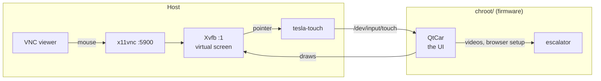
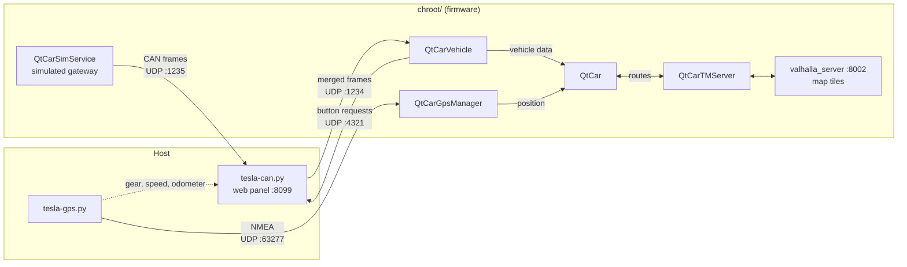
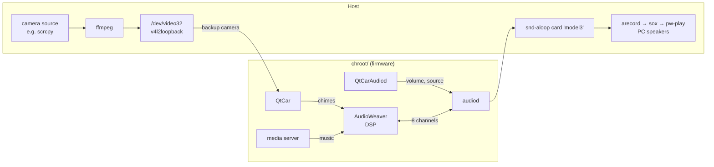

# How it works

## The pieces

Three views of the same setup: on the left what runs on the host, on the right what runs in the
chroot (the patched firmware image). Everything talks over loopback.

**Screen and touch**

**Vehicle data, GPS, navigation**

**Sound and camera**

- **The image** (`mcu3-new.ext4`) is a copy of the firmware's root filesystem with the patch
  kit applied. It's loop-mounted at `chroot/`; `/proc`, a few `/dev` nodes, a private tmpfs
  `/dev/shm`, a `net_cls` cgroup and the optional devices/folders are mounted into it.
- **QtCar** runs in the chroot as on the car (`/startup.sh` from the kit sets its environment
  and preloads the shims). Its privileged helper, the escalator, runs next to it.
- **The firmware services** (`qtcar-*`, `valhalla`, `audiod`, ...) are started by
  `/usr/local/bin/qtcar-service` (from the kit) the way their runit scripts do it on the car:
  same binary, options and user, minus the car's sandboxing (minijail, AppArmor, cgroups,
  firewall), and on loopback instead of the car's internal network (192.168.90.x). They find
  each other by UDP broadcast on 127.255.255.255.
- **The host helpers** feed what the car's hardware would: the screen and touch, CAN frames,
  GPS, the speakers, the camera.

## The patch kit

`mcu3-patchkit/mcu3_patch.py` turns the pristine dump into the working image and can be applied
again at any time (it only does what's missing). Groups:

| Group | What |
|---|---|
| `core` | binary patches QtCar needs on a PC: cgroup/escalator checks, energy model asserts, fatal asserts made non-fatal |
| `cef` | the browser: no-sandbox shim, EGL pixmap shim, V8 snapshot files, WebAudio oscillator patch |
| `mesa` | Mesa 18.0.5 software renderer, LLVM 6.0 and their libraries (open source, downloaded from the Ubuntu 16.04 archive) |
| `assets` | missing asset links |
| `system` | users, `settings.conf` keys, DNS, directories, `/startup.sh`, `qtcar-service`, the `sv` wrapper |
| `vehicle` | the simulator without its drive-inverter module (tesla-can.py sends that instead) |
| `audio` | the sound card on snd-aloop (`asound.conf`), audiod without the A2B amplifier bus |
| `identity` | VIN and birthday files (only with `--vin` / `--birthday`) |

Every binary patch checks the original bytes and the file's SHA-1 first; an unknown firmware
version is refused. `mcu3_patch.py --list` lists everything. Details and the history of each
patch: [`mcu3-patchkit/README.md`](../mcu3-patchkit/README.md).

## Ports

All on localhost (the chroot shares the host's network).

| Port | Who |
|---|---|
| TCP 5900 | x11vnc (VNC) |
| TCP 8099 | web panel (tesla-can.py) |
| TCP 9222 | CEF DevTools (browser) |
| TCP 4220 | QtCar's data value server (`_data_get_value_request_?name=...`) |
| TCP 4030 / 4160 / 4190 / 4060 / 4050 | QtCarVehicle / GpsManager / simulator / NetManager / Audiod |
| TCP 8002 | valhalla_server |
| TCP 18466 | audiod's command port |
| UDP 1234 | CAN frames to QtCarVehicle (from tesla-can.py) |
| UDP 1235 | CAN frames from the simulator to tesla-can.py |
| UDP 4321 | the UI's requests to the gateway (tesla-can.py answers) |
| UDP 20100 | tesla-can.py's control port (tesla-gps.py, `tesla-can.py --set`) |
| UDP 63277 | NMEA to GpsManager |

The sandbox (`sandbox.sh`) uses the same ports; only one of the two can run.

## A run

`./tesla start` (in `tools/start.sh`): load the settings, check, `sudo -v`, clean up leftovers
of an earlier run, mount the image, start Xvfb and x11vnc, mount `/proc` and friends, start
tesla-touch and the viewer, set up the features (settings DB values, `settings.conf` keys,
devices), start the firmware services (each in a loop that restarts it when it exits), start the
host helpers, then QtCar in a loop. On exit (Ctrl+C, `./tesla stop`, a closed terminal): stop
everything in the chroot (SIGTERM, SIGKILL after 3 s), the helpers, unmount deepest first,
summarize the logs.

Each run has a folder `logs/<date-time>/`:

| File | What |
|---|---|
| `<service>.log` | output of each firmware service, with `tesla: <service> exited (N) ... [t=EPOCH]` on restarts |
| `qtcar.log` | QtCar's output |
| `can.log`, `gps.log`, `audio.log`, `camera.log`, `touch.err`, `xvfb.log`, `x11vnc.log` | the host helpers |
| `events.log` | start, the services started, QtCar starts and exits (with the reason for its own restarts), stop |
| `config` | the settings of the run and their source |
| `state`, `pids` | for `./tesla stop` / `status`: the start's pid, what it mounted, the helpers' pids |

`logs/latest` points to the last run, `logs/current` to the running one.

## QtCar's stored state

QtCar keeps settings and many car values in `/home/tesla/.Tesla/data/QtCarSettings.db` inside the
image (and services with their own user in their own home). Values stored there survive restarts
and config changes, which explains many "worked once, not again" effects.
`vehicle/qtcar-settings.py` reads and edits it. `/home/tesla/.Tesla/car/settings.conf` holds the
car's configuration file; the kit and `./tesla start` merge keys into it.
